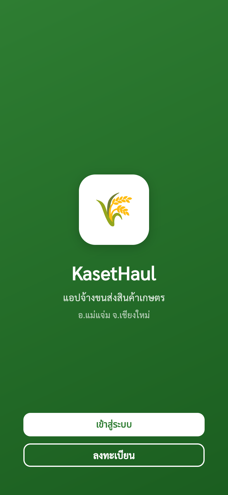
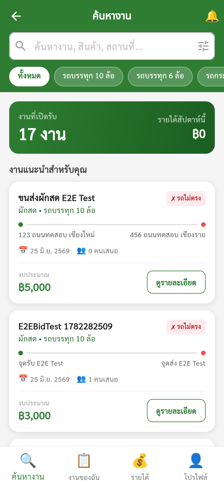
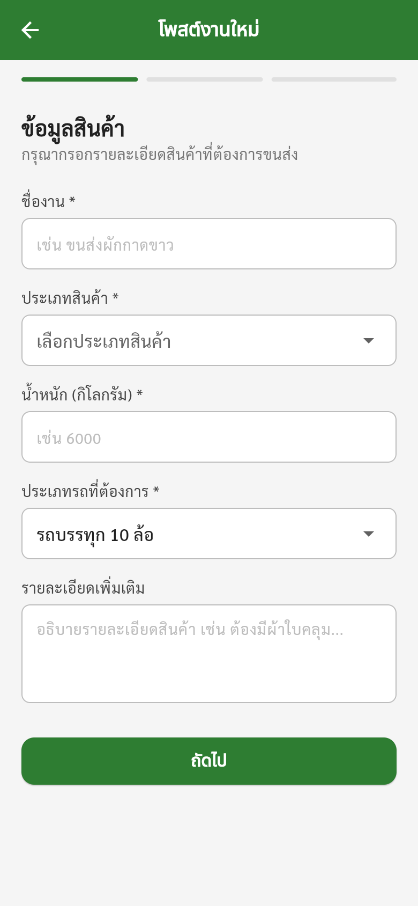
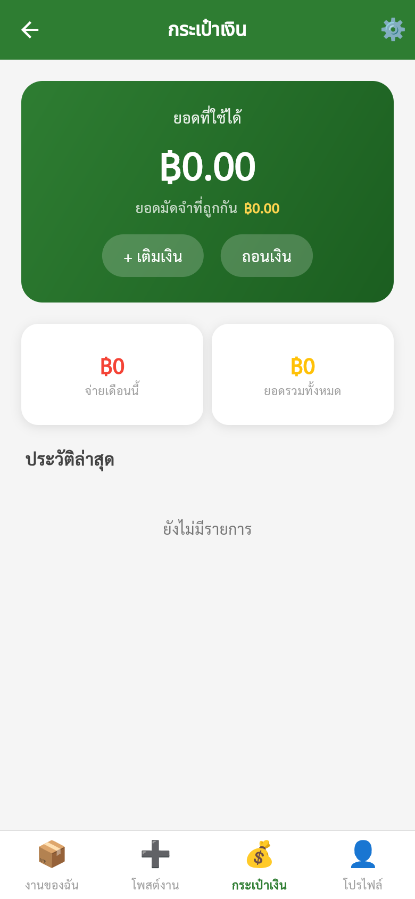
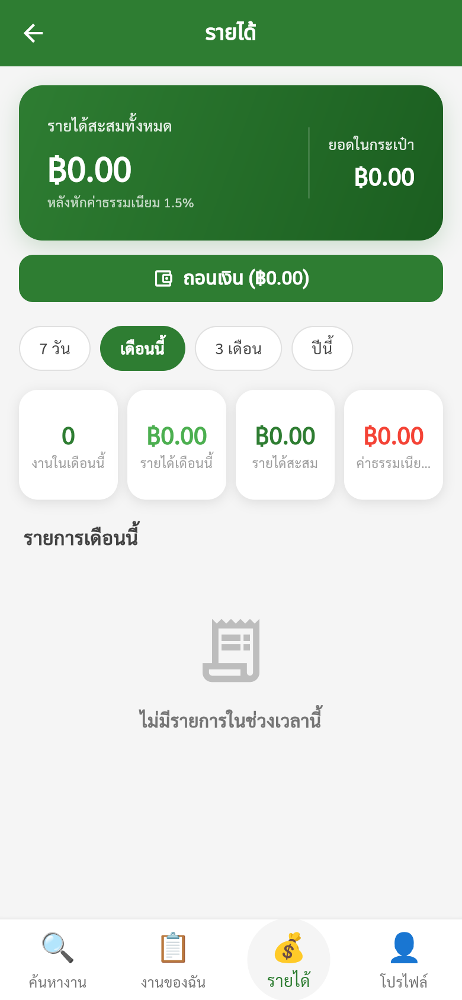

# KasetHaul — Agricultural Freight Marketplace

A two-sided marketplace that matches farmers who need to move their harvest with truck owners who have spare capacity.

Built for Mae Chaem district, Chiang Mai, where farmers currently find trucks by word of mouth — paying broker fees of **10–15%** with no price transparency and no way to track their goods once they leave the farm.

**Final-year project · still in development**

<p align="left">
  
  
  
  
  
  
</p>

---

## Screens

<table>
<tr>
<td width="20%"></td>
<td width="20%"></td>
<td width="20%"></td>
<td width="20%"></td>
<td width="20%"></td>
</tr>
<tr>
<td align="center"><sub><b>Welcome</b></sub></td>
<td align="center"><sub><b>Job search</b><br>filter by truck type,<br>warns on mismatch</sub></td>
<td align="center"><sub><b>Post a job</b><br>multi-step form<br>with validation</sub></td>
<td align="center"><sub><b>Wallet</b><br>available vs.<br>held balance</sub></td>
<td align="center"><sub><b>Earnings</b><br>by period, with<br>platform fee shown</sub></td>
</tr>
</table>

---

## What it does

| Feature | How it works |
|---|---|
| **Competitive bidding** | Clients post a job; contractors bid against each other. The client picks on price and rating — no broker sets the price. Platform fee is 3%, split 1.5% each side. |
| **7-stage job tracking** | `waiting` → `assigned` → `arrived at pickup` → `goods collected` → `in transit` → `arrived at drop-off` → `delivered`, with photo proof attached at each handover. |
| **Escrow-style wallet** | Funds are held when a job is assigned and released to the contractor only after delivery is confirmed — so neither side has to trust the other up front. |
| **Identity verification** | Phone OTP for everyone, plus Thai ID verification for contractors. |
| **Truck matching** | Contractors register multiple trucks; the app checks a truck against the job's requirements before allowing a bid. |
| **Two-way reviews** | Both sides rate each other after a job closes, feeding back into bid selection. |
| **Admin dashboard** | User review, truck approval, platform reporting. |

Three roles: **Client** · **Contractor** · **Administrator**

---

## How it's built

**State management —** every screen loads its state through a BLoC. No screen calls a repository directly from the widget tree, so UI and data access stay separated and each BLoC is unit-testable on its own.

**Data —** 14 models on Cloud Firestore, with access controlled by [`app/firestore.rules`](app/firestore.rules).

**Structure —** organised by feature rather than by layer, so everything belonging to one part of the app lives together:

```
app/lib/
├── core/           config · theme · routing · repositories · services
├── models/         14 data models
├── features/       auth · job · wallet · truck · review · profile · notification
│   └── <feature>/
│       ├── bloc/   business logic + events + states
│       └── pages/  screens
└── shared/         widgets reused across features
```

---

## How it was designed

The system was specified before any code was written — a full **SRS with 39 use case specifications**, use case diagrams, class diagrams, sequence diagrams and an ER diagram. Screens were mocked up in HTML first (see [`Mockup/`](Mockup/)) and then built to match.

The problem itself came from field research: the team interviewed farmers in Mae Chaem and collected data on real freight jobs before deciding what to build. That work was presented at **Startup Thailand League 2026** and **Research to Market (R2M) #14**, representing Maejo University.

---

## Status

In active development as a final-year project. Bidding, job tracking, wallet and review flows are implemented; some admin and reporting screens are still being built.

---

<sub>This repository is published as a portfolio piece to show how the project is built. The code is not licensed for reuse.</sub>

<sub>By [Thatchaphon Saengsonthaweesak](https://github.com/Tenten1007) — Information Technology, Maejo University</sub>
